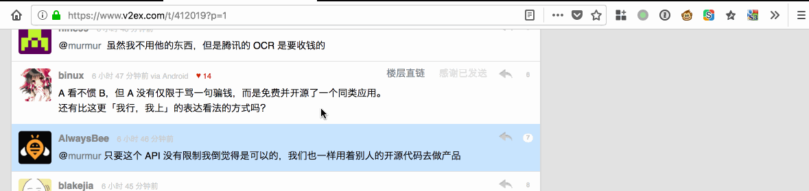
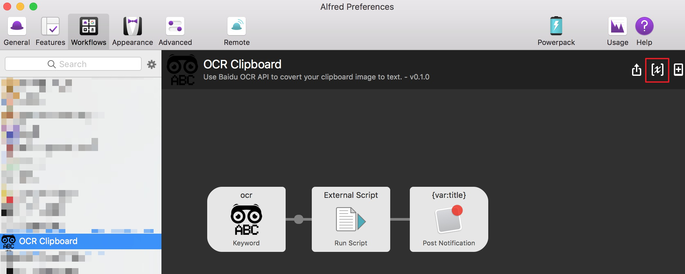
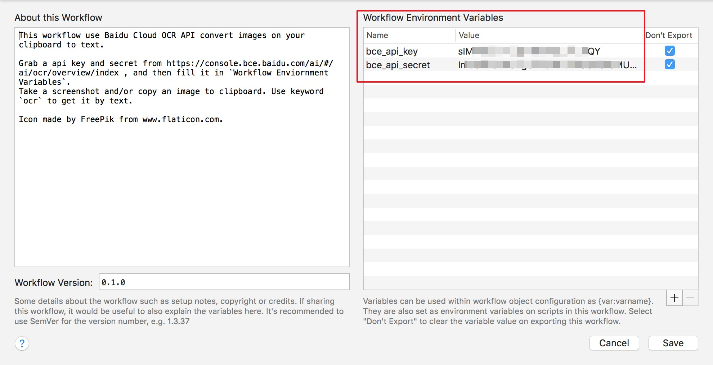

# Alfred Clipboard OCR

一个对剪贴板中的图片内容调用百度云 API 做 OCR 识别的 Alfred 工作流。

感谢：V2EX, Firefox, Snipaste, CotEditor 在上图中的出场（排名不分先后）

## 安装方法

1. [下载 workflow](https://github.com/oott123/alfred-clipboard-ocr/releases) 并使用 Alfred 安装
2. 去 [百度云控制台](https://console.bce.baidu.com/ai/#/ai/ocr/overview/index) 申请一个文字识别的应用，并记下 API Key 和 API Secret
3. 打开 Alfred 设置，找到这个 workflow 并打开变量控制面板
   
4. 将第二步中获得的 API Key 和 API Secret 填入对应的变量中
   

## 使用说明

首先，使用任意一个截图软件将想要识别的区域截取下来。你也可以复制图片内容（而非图片文件）到剪贴板中。

在 Alfred 中输入 `ocr` 并回车，稍等片刻，即可获得识别的文字。

识别后的文字会自动复制到你的剪贴板中。识别并复制成功后，Alfred 会弹出桌面通知提醒你。

## 常见问题

### 开了代理就报错

常见的错误有：

* Bad URI
* Method Not Allowed
* Request Failed

遇到此类问题请先尝试关闭代理确认是否为代理问题。若确认是代理问题而又不希望关闭代理软件的，可以在 Workflow Environment Variables 一栏增加两个变量如下：

| Name         | Value | Don't Export |
| ------------ | ----- | ------------ |
| `HTTP_PROXY` | 空字符串  | NO           |
| `http_proxy` | 空字符串  | NO           |

重试即可。

## 授权协议

AGPLv3

#### 开源软件使用许可

[pngpaste](./pngpaste/LICENSE)

#### 图标授权 (Icon Credit)

Icon made by [Freepik](http://www.freepik.com) from [www.flaticon.com](https://www.flaticon.com/).